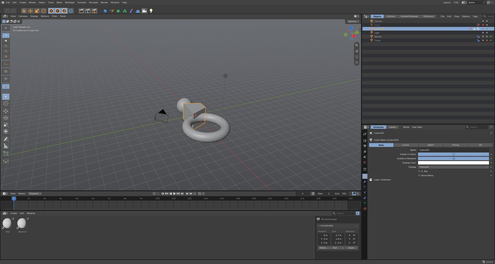

# Blender4D

Blender 5.2, but it works like Cinema 4D R24.

I used C4D for years before moving to Blender, and the thing I kept missing wasn't any one feature, it was how C4D *feels*. The Object Manager, the Attribute Manager, generators that work off their children, M~T to extrude without thinking about it. So this is Blender with all of that put back, and nothing taken away. Every Blender tool, editor and workspace is still there if you want it.



This is an unofficial fork. It isn't made or endorsed by the Blender Foundation or Maxon. Blender is a trademark of the Blender Foundation, Cinema 4D is a trademark of Maxon.

## Download

Windows 64-bit build: grab the zip from [Releases](https://github.com/Anaadh/blender4d/releases), unzip, run `blender.exe`. No installer, and it keeps its settings in its own folder so it won't touch a normal Blender install. Cycles GPU rendering isn't in the prebuilt zip yet (CPU and EEVEE are fine), build it yourself if you need that.

## Fork or add-on?

Most of this is a Python add-on called [C4D Feel](https://github.com/Anaadh/c4d-feel). It runs on normal Blender 5.2 and you don't need this fork to use it.

The fork exists for the things Python can't do:

- **A real Object Manager.** The Outliner gets a "Cinema 4D style" mode: editor and render dots, the green check for generators, and tag icons on every row. Drag and drop parenting, double click rename and everything else from the Outliner still works. You can drag a tag onto another object to copy it, and cameras get a little button to look through them.
- **A big command palette.** The top bar gets a second, taller row so the palette icons are the size they are in C4D instead of tiny header icons.
- **C4D Feel built in**, switched on, with the C4D layout and theme.

## What's in it

**Hotkeys**
- Alt + left / middle / right drag to orbit, pan, zoom. Hold 1/2/3 and drag for the camera, 4/5/6 to move, scale, rotate the selection.
- E / R / T, Space for the last tool, 8 / 9 / 0 for lasso, live and rectangle selection, X / Y / Z axis locks.
- The two key commands: M~T extrude, M~S bevel, M~W inner extrude, U~L loop, K~K knife and the rest. Tap the first key and a list of second keys pops up.
- C make editable, Alt+G group, Shift+G ungroup, Enter for model / point mode, H and S to frame, F1-F5 views, F6-F9 playback and keys, V pie, Shift+C Commander.
- You can turn the C4D keymap off in the add-on preferences and get Blender's back.

**Managers and layout**
- Menu bar laid out like C4D (Create, Modes, Select, Tools, Mesh, MoGraph, Animate...).
- Mode palette (make editable, points / edges / polygons, enable axis, solo, snap) on top of Blender's toolbar, so the Blender tools are still right there.
- Attribute Manager with Basic, Coord., Object and Phong tabs.
- Coordinate Manager with Object (Rel) / World and Size / Scale, and it works on point selections too.
- Material Manager. Double click a material and it opens in its own node window, styled like Redshift's shader graph.
- Render Settings in their own window, Alt+R for an interactive render region.

**Objects**
- Parametric primitives: Cube (with fillet), Sphere, Cylinder (caps on/off), Cone, Plane, Torus, Pyramid. Editable until you press C.
- Splines: Circle, Rectangle, Star, Arc, Helix, Text.
- Extrude (with subdivision and cap fillet), Lathe, Sweep (scale and twist along the path) and Loft, all working off their child splines.
- Cloner (linear, radial, grid) with a random effector and a Plain effector you can move around.
- Deformers as child objects. Bend, Twist, Taper, Squash & Stretch, Wave. Move one under a different object and the effect follows.
- Tags: Phong, Material, Target, Look at Camera, Align to Spline, Protection, Display, Compositing.
- Look through a camera and navigating moves the camera, like in C4D.

## What doesn't work

Being honest about it:

- **No .c4d files.** Blender can't open them. Export FBX, Alembic or USD from C4D.
- **No Xpresso, Takes, or the full Fields system.** Geometry Nodes and drivers cover a lot of the same ground, but they aren't the same thing.
- **The generators are Geometry Nodes under the hood.** They behave like C4D's in normal use, but they're not 1:1. Loft goes by child name order, Sweep has scale and twist but no rails, and the Cloner takes one Plain effector rather than a list.
- **Some C4D keys replace Blender ones in the viewport.** G steps frames instead of grabbing (E moves), H frames instead of hiding (use Alt+H or the dots), X/Y/Z lock axes instead of deleting (use Backspace). Turn the C4D keymap off if that bugs you.
- **No vertical manager tabs** down the right edge. The tabs sit in the manager headers instead.
- **It doesn't look pixel perfect.** Blender draws its own widgets and fonts, so it's close, not identical. The icons are my own, not Maxon's.
- **Windows only, tested.** It should build anywhere Blender builds, but I've only built and used it on Windows 11.

## Building

Same as regular Blender. On Windows you need Visual Studio 2022 17.14 or newer, CMake and git-lfs.

```
git clone -b blender4d https://github.com/Anaadh/blender4d.git
cd blender4d
make update
make release
```

Other platforms: see Blender's [build docs](https://developer.blender.org/docs/handbook/building_blender/).

A full build is heavy. If your machine gets unstable, cut the jobs down, for example with Ninja: `ninja -j 4`. Mine needed that.

If you want Blender4D's settings separate from a normal Blender install, make an empty folder called `portable` next to `blender.exe`.

## How the fork is laid out

- `blender4d` is the default branch: the official `v5.2.2` release plus the Blender4D commits on top.
- `main` and everything else is Blender's, as it comes from upstream.
- The C++ changes are small and live in a few places: `editors/space_outliner`, `editors/space_topbar`, `editors/screen`, `editors/interface` and `makesrna`. The add-on is in `scripts/addons_core/c4d_feel`. Moving to a new Blender release is mostly rebasing those commits onto the new tag.

## Feedback

Open an issue if something breaks or you want something to feel more like C4D. If you're coming from C4D too, I'd love to hear what you miss most.

## License

GPL, same as Blender. Blender's own read-me is in [`README.md`](../README.md) further down.
